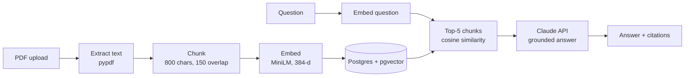

# AI Document Analyzer

Upload a PDF, ask questions in plain English, and get answers grounded in the document — with clickable citations back to the exact passages used.


## Features

- **Semantic search** — PDF text is chunked and embedded with `all-MiniLM-L6-v2`, stored in PostgreSQL with **pgvector**, and searched with an HNSW cosine index
- **Cited answers** — the top-matching chunks are sent to the **Claude API**, which answers only from those excerpts and cites them inline (`[1]`, `[2]`)
- **Clickable sources** — citation markers in the UI jump to and expand the source chunk
- **Async ingestion** — uploads return immediately; extraction and embedding run in the background while the UI polls status (`processing` → `ready` / `failed`)
- **Auth** — JWT authentication with bcrypt hashing; every document is scoped to its owner
- **One-command setup** — Docker Compose runs the API, frontend, and Postgres

## How It Works



## Tech Stack

| Layer | Tools |
| --- | --- |
| Backend | Python 3.12, FastAPI, SQLAlchemy, Alembic, pypdf |
| AI / Retrieval | sentence-transformers, pgvector (HNSW), Anthropic Claude API |
| Frontend | React 19, Vite, Tailwind CSS, React Router |
| Infrastructure | Docker, Docker Compose, PostgreSQL 16 |

## Quick Start

**Prerequisites:** Docker Desktop and an [Anthropic API key](https://console.anthropic.com).

1. Create `doc-analyzer/apps/.env`:

   ```
   ANTHROPIC_API_KEY=your-key-here
   ```

2. Start everything:

   ```bash
   cd doc-analyzer/apps
   docker-compose up -d --build
   docker-compose exec api alembic upgrade head
   ```

3. Open the app:

   - Frontend: http://localhost:5173
   - API docs (Swagger): http://localhost:8000/docs

The first upload takes a little longer while the embedding model downloads (~90 MB).

## API

| Method | Endpoint | Description |
| --- | --- | --- |
| `POST` | `/auth/register` | Create an account |
| `POST` | `/auth/login` | Get a JWT access token |
| `GET` | `/me` | Current user |
| `GET` | `/documents` | List your documents |
| `POST` | `/documents` | Upload a PDF (multipart form) |
| `GET` | `/documents/{id}` | Document details and status |
| `DELETE` | `/documents/{id}` | Delete a document |
| `POST` | `/documents/{id}/ask` | Ask a question → `{ answer, citations }` |

All `/documents` routes require `Authorization: Bearer <token>`.

## Configuration

| Variable | Where | Purpose |
| --- | --- | --- |
| `ANTHROPIC_API_KEY` | `apps/.env` | Claude API key |
| `CLAUDE_MODEL` | `docker-compose.yml` | Model used for answers (default: `claude-haiku-4-5-20251001`) |
| `DATABASE_URL` | `docker-compose.yml` | Postgres connection string |
| `JWT_SECRET` | `docker-compose.yml` | Token signing secret — change for any real deployment |
| `VITE_API_URL` | `docker-compose.yml` | API base URL for the frontend |

## Design Decisions

- **800-character chunks with 150 overlap.** MiniLM truncates input at ~256 tokens; larger chunks were silently cut off before embedding.
- **Normalized embeddings + cosine distance**, matching the `vector_cosine_ops` HNSW index.
- **Grounded prompting.** Claude is instructed to answer only from the numbered excerpts and to say when the answer isn't in the document, which limits hallucination.
- **Graceful degradation.** If the Claude API call fails, `/ask` falls back to returning the retrieved chunks instead of erroring.
- **CPU-only PyTorch** in the Docker image, avoiding several GB of unused GPU libraries.

## Local Development (without Docker)

```bash
cd doc-analyzer/apps/api
python -m venv venv
venv\Scripts\activate        # Windows
# source venv/bin/activate   # macOS/Linux
pip install -r requirements.txt
alembic upgrade head
uvicorn main:app --reload --port 8000
```

```bash
cd doc-analyzer/apps/web
npm install
npm run dev
```

Requires a local PostgreSQL with the pgvector extension, and an `apps/api/.env` with `DATABASE_URL` pointing to it.

## Roadmap

- [ ] Retrieval evaluation set with hit-rate metrics
- [ ] pytest suite and GitHub Actions CI
- [ ] OCR for scanned PDFs
- [ ] Multi-document search

## License

MIT
